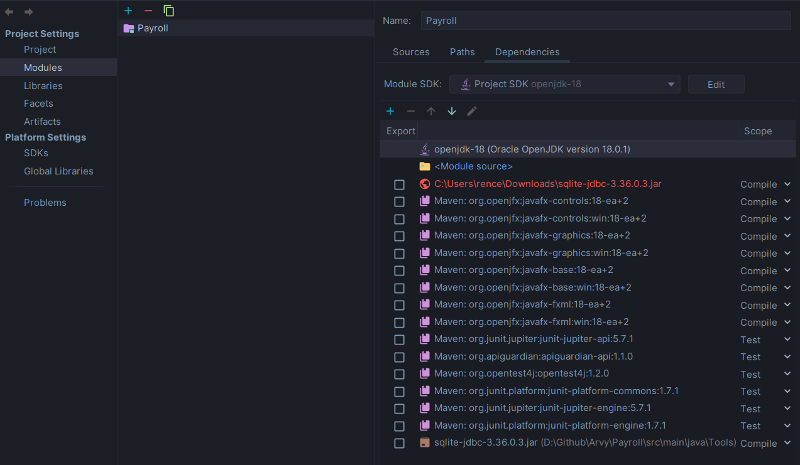

# Project Setup

## Cloning the project

```shell
git clone https://github.com/JonArvy/Payroll
```

## VM Options

Go to the `Run` tab of IntelliJ and click on `Modify Options` and click on `Add VM Options`. Enter the following line of
command to the VM field

```shell
--module-path
"C:\Users\Arvy Enriquez\Desktop\Programming\javafx-sdk-18.0.2\lib"
--add-modules
javafx.controls,javafx.fxml,javafx.swing
```

## Add driver dependencies

The project needs the SQLite JDBC driver to run. Add the driver to the Project Structure (`Ctrl+Alt+Shift+S`). Go to the
Modules tab and click on dependencies.


Click on the `+` button and add the driver found on

```shell
src/main/java/Tools/sqlite-jdbc-3.36.0.3.jar
```

